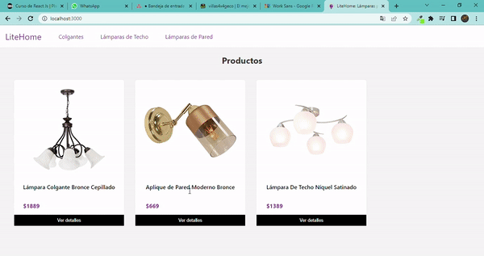

# LiteHome

E-Commerce para la venta de productos iluminación y ventilación para la marca LiteHome.

Este proyecto fue creado con [Create React App](https://create-react-app.dev) y [Firebase](https://firebase.com).

## Available Scripts

Pasos para poder trabajar en este proyecto:

### `clone`
Se deberá clonar el repositorio.

### `npm install`
Para instalar las dependencias.

### `npm start`
Para ejecutar el servidor del desarrollo.
Abrir [http://localhost:3000](http://localhost:3000) para visualizar en el browser.

## `Funciones de la aplicación`
- Renderizar los productos cargados en la firebase.
- Filtrar estos productos por categoría.
- Seleccionar cierta cantidad de cierto producto para agregar al carrito.
- Crear listado de productos en el carrito.
- Crear orden de compra con datos del formulario.

## `Campos de la base de datos del producto`
category
description
img
name
price
stock

